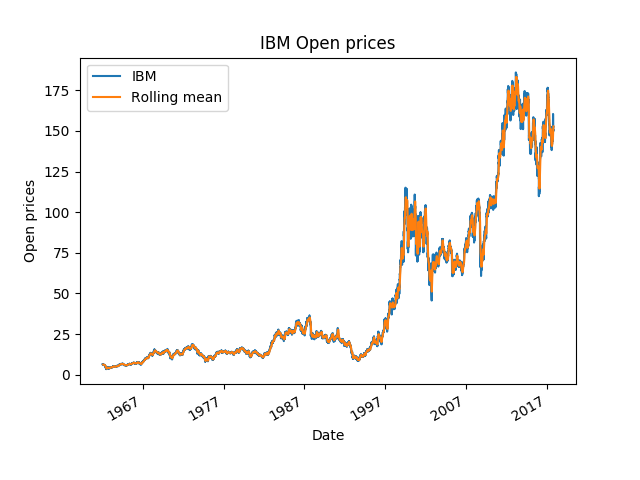
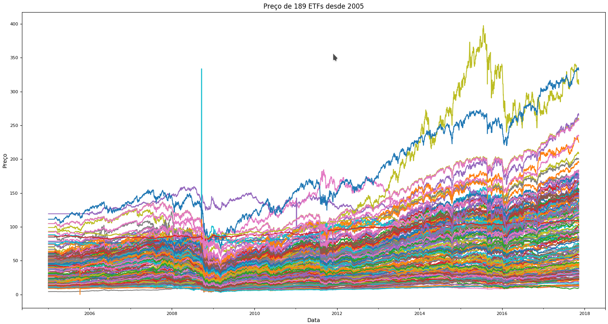

# cefetmg_ml_final_project
Trabalho final da disciplina machine learning do cefetmg

##Baseline
Para o baseline, utilizamos a média rolante com janela=5. Sua taxa de acerto ficou próxima de 50%, muito ruim.

##Primeira implementação: regressão logística
Ao utilizar a regressão logística off-the-shef do sklearn, consegui os seguintes resultados para a ETF spy.us:
accuracy: 0.6619718309859155
precision: 0.6330798479087453
recall: 0.9353932584269663
f1: 0.7551020408163266

##Correlação aparente
Investigando o dataset, percebi que o preço das ETFs seguem uma onda

##Segunda iteração da regressão logística
Inspirado pela imagem acima, utilizei ETFs companheiras para prever o preço de uma ETF alvo. As companheiras foram escolhidas com base na correlação. Foi feita uma busca rápida com poucas variações da quantidade de companheiras e da correlação máxima, e o resultado melhorou. Estes são os resultados da melhor combinação encontrada:
accuracy: 0.7636932707355243
precision: 0.7518427518427518
recall: 0.8595505617977528
f1: 0.8020969855832241